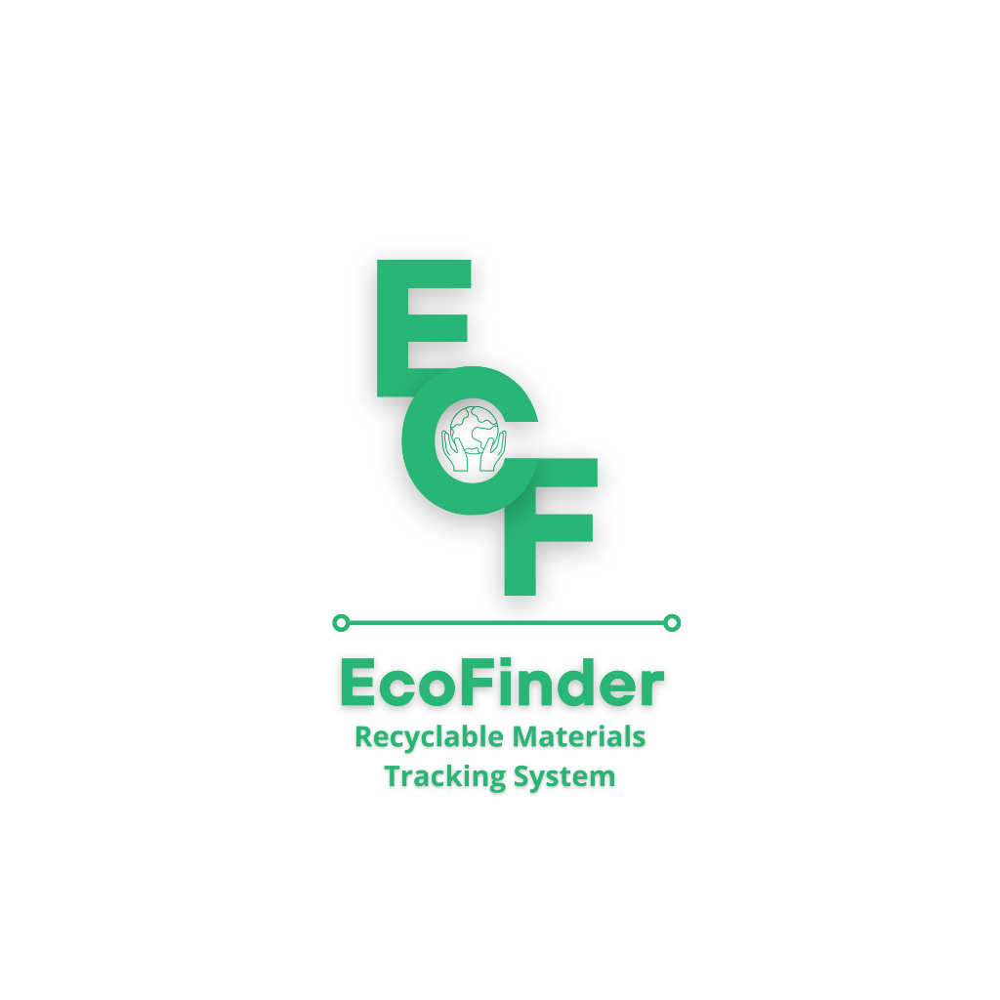
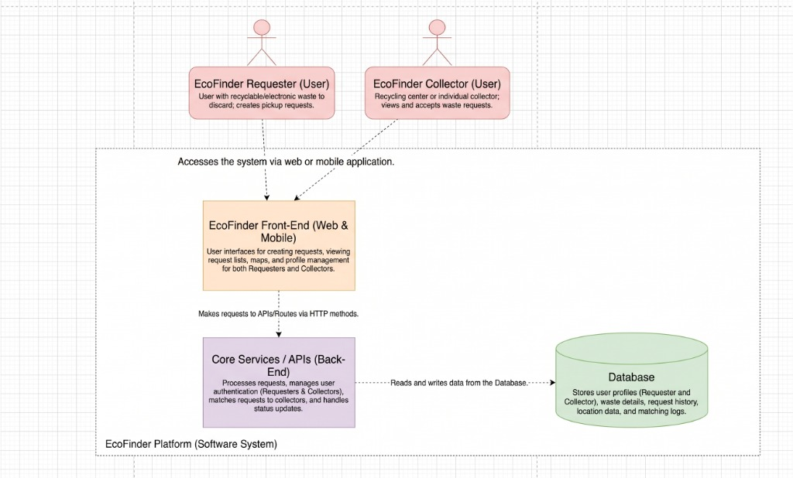
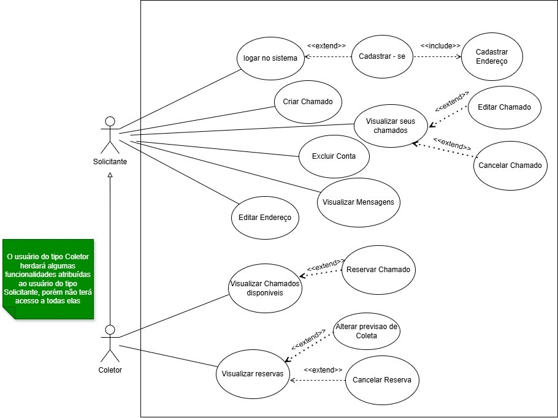
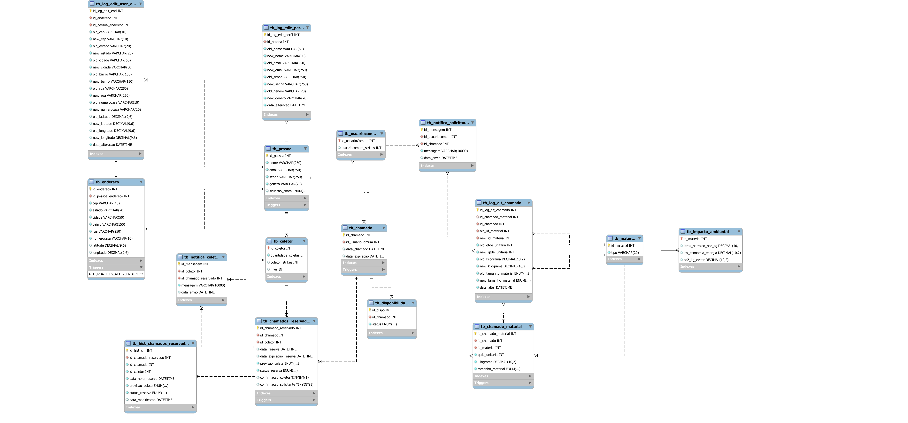

# <p align="center"></p>

<h1 align="center">EcoFinder — Recyclable Materials Tracking & Social Logistics Platform</h1>

<p align="center">
  <strong>Bridging the gap between waste generators and recyclable material collectors through social technology, clean architecture, and georeferenced logistics.</strong>
</p>

<p align="center">
  <a href="https://nodejs.org/"></a>
  <a href="https://react.dev/"></a>
  <a href="https://www.mysql.com/"></a>
  <a href="https://www.scrum.org/"></a>
  <a href="#un-sustainable-development-goals-sdgs"></a>
  <a href="#license"></a>
</p>

<p align="center">
  <a href="#-about-the-project">About</a> •
  <a href="#-social--environmental-impact">Impact & SDGs</a> •
  <a href="#-system-architecture--clean-design">Clean Architecture</a> •
  <a href="#-project-artifacts--diagrams">Artifacts & Diagrams</a> •
  <a href="#-agile-development-methodology">Methodologies</a> •
  <a href="#-tech-stack">Tech Stack</a> •
  <a href="#-getting-started">Getting Started</a> •
  <a href="#-academic-context">Academic Context</a> •
  <a href="#-vers%C3%A3o-em-portugu%C3%AAs">Versão em Português 🇧🇷</a>
</p>

---

## 📖 About the Project

**EcoFinder** is a social technology computing platform designed to optimize the reverse logistics chain for urban solid waste (*Resíduos Sólidos Urbanos - RSU*). By establishing a direct, georeferenced bridge between waste generators (citizens, commercial establishments, public institutions) and informal/cooperative waste collectors (*catadores de materiais recicláveis*), EcoFinder transforms prospective, erratic waste collection into an efficient, scheduled, and dignified workflow.

### 🚩 The Problem
In Brazil, despite the regulatory framework of the National Solid Waste Policy (*PNRS - Lei nº 12.305/2010*), over **41% of solid waste** is still disposed of inadequately in uncontrolled landfills and open dumps (Abrelpe, 2023), resulting in an annual economic drain of approximately **R$ 14 billion** in unrecovered recyclable materials (Ipea, 2020).

Meanwhile, nearly **1 million waste collectors** form the backbone of Brazilian recycling, collecting the vast majority of all recovered materials. However, they operate in conditions of high vulnerability, social invisibility, and severe information asymmetry:
* Collectors walk random, exhaustive routes without knowing where, when, or what materials are available.
* Citizens lack accessible, direct channels to request recycling pickups.
* Existing corporate reverse logistics systems focus only on the top of the industrial supply chain, ignoring organic neighborhood micrologistics.

### 💡 The Solution
EcoFinder introduces a **user-centric, low-cognitive-load web and mobile platform** adhering to **WCAG 2.1 accessibility standards**. Waste generators can register recyclable pickup requests with typology and estimated quantities, while local collectors can view geolocated pickups on a real-time map, reserve requests, receive scheduled routes, and track their positive environmental footprint.

---

## 🌍 Social & Environmental Impact

EcoFinder directly aligns with the United Nations 2030 Agenda and the **Sustainable Development Goals (SDGs)**:

| SDG | Objective | EcoFinder Contribution |
| :---: | :--- | :--- |
|  | **No Poverty** | Increases daily productivity and income predictability for informal collectors. |
|  | **Decent Work & Economic Growth** | Humanizes labor conditions, reduces physical fatigue, and integrates collectors into formal digital workflows. |
|  | **Sustainable Cities & Communities** | Mitigates irregular dumping in streets and vacant lots, preventing clogged drainage and flood risks. |
|  | **Responsible Consumption & Production** | Fosters circular economy practices at the household and commercial level. |
|  | **Climate Action** | Reduces greenhouse gas emissions and fossil fuel energy consumption by redirecting recyclables from landfills. |

> **Real-World Pilot**: The initial deployment and empirical usability validation are conducted with the pilot community of **Bairro Satélite Íris I**, in Campinas - SP, evaluating usability metrics, response times, and perceived logistics efficiency (Rutkowski, 2020).

---

## 🏛️ System Architecture & Clean Design

EcoFinder is engineered using **Clean Architecture** principles and a **modular structure**, emphasizing high cohesion, loose coupling, separation of concerns, and extensive **code reusability (DRY - Don't Repeat Yourself)**.

```
                  ┌─────────────────────────────────────────┐
                  │      Presentation Layer (React SPA)     │
                  │  (Atomic Components, Hooks, API Client) │
                  └────────────────────┬────────────────────┘
                                       │ HTTP / REST (JSON)
                                       ▼
                  ┌─────────────────────────────────────────┐
                  │       API / Controller Layer (Node)     │
                  │  (Routing, Auth Middleware, Validators) │
                  └────────────────────┬────────────────────┘
                                       │
                                       ▼
                  ┌─────────────────────────────────────────┐
                  │         Business Rules / Use Cases      │
                  │  (Pickups, Reservations, Impact Engine) │
                  └────────────────────┬────────────────────┘
                                       │
                                       ▼
                  ┌─────────────────────────────────────────┐
                  │       Data Access & Persistence         │
                  │   (Repositories, Transactions, MySQL)   │
                  └─────────────────────────────────────────┘
```

### 🧩 Architectural Highlights & Modular Decomposition

1. **Independent Functional Modules**:
   * **`Auth & Profile Module`**: Manages secure authentication, role segregation (`Solicitante` vs. `Coletor`), profile audit logs, and account lifecycle.
   * **`Pickup Request Module (Chamados)`**: Handles creation, classification (Paper, Plastic, Metal, Glass, Electronics), expiration logic, and modification tracking.
   * **`Reservation & Dispatch Module`**: Coordinates concurrency-safe reservation locks, status state machines (`Pendente`, `Reservado`, `Coletado`, `Cancelado`), and double confirmation mechanisms.
   * **`Geolocation & Route Module`**: Decouples spatial queries, coordinates geocoding (Lat/Lng), and proximity filters.
   * **`Environmental Impact Metrics Engine`**: Computes avoided CO₂ emissions, saved energy (kWh), and conserved petroleum based on collected materials.
   * **`Notification & Audit Module`**: Manages user notifications, strike systems, and database triggers for audit trailing.

2. **Code Reusability & Maintainability**:
   * **Frontend Component Library**: Reusable UI components (buttons, modals, form inputs, high-contrast map badges) built using design tokens to guarantee accessibility across all screens.
   * **Shared Validation & Security Middlewares**: Unified input sanitization, JWT authorization guards, and error-handling pipelines.
   * **ACID Relational Integrity**: MySQL transactional management preventing race conditions (e.g., dual reservation of the exact same pickup).

---

## 📊 Project Artifacts & Diagrams

### 1. Component & System Architecture Diagram
The component diagram illustrates the layered client-server architecture between the React front-end (web & mobile), the Node.js API core services, and the MySQL relational database layer.

<p align="center">
  
</p>

---

### 2. Use Case Diagram
The use case diagram highlights the functional scope and interaction models for both user profiles: **Requester (*Solicitante*)** and **Collector (*Coletor*)**, including inclusion (`<<include>>`), extension (`<<extend>>`), and specialized role inheritance.

<p align="center">
  
</p>

---

### 3. Entity-Relationship Diagram (ERD / DER)
The relational database model enforces transactional integrity (ACID), geolocated coordinates, audit trails, and multi-category recyclable material tracking.

<p align="center">
  
</p>

---

## ⚡ Agile Development Methodology

EcoFinder combines **Scrum** and **Kanban** (Scrumban hybrid approach) to ensure adaptive planning, continuous quality assurance, and user-driven evolutionary development.

```
       ┌───────────────────────────────────────────────────────────────┐
       │                       SCRUM FRAMEWORK                         │
       │  • Sprint Planning  • 2-Week Sprints  • Reviews & Retros      │
       └──────────────────────────────┬────────────────────────────────┘
                                      │ Orchestrated via
                                      ▼
       ┌───────────────────────────────────────────────────────────────┐
       │                       KANBAN WORKFLOW                         │
       │   [To Do]  ──►  [In Progress]  ──►  [Review / PR]             │
       │                                            │                  │
       │   [Production]  ◄──  [Staging / CI Tests] ◄┘                  │
       └───────────────────────────────────────────────────────────────┘
```

### 1. Scrum (Iterative Value Delivery)
* **Time-Boxed Sprints**: Development proceeds in bi-weekly sprints focused on functional deliverables (e.g., Elicitation, Prototyping, Geolocation API, Booking Engine, Pilot Testing).
* **Role Distribution**: Clear ownership across Product Backlog items, technical refinement, and stakeholder alignment.
* **Sprint Ceremonies**:
  * *Sprint Planning*: Deconstructing user stories from field interviews with collectors and residents.
  * *Review & Demos*: Presenting functional increments to community leaders and academic advisors.
  * *Retrospectives*: Refining technical architecture and accessibility UX feedback.

### 2. Kanban (Visual Flow & Continuous Integration)
* **Trello & GitHub Project Boards**: Real-time visibility into WIP (Work-In-Progress), preventing cognitive bottlenecks.
* **Workflow Lanes**:
  $$\text{Backlog} \longrightarrow \text{To Do} \longrightarrow \text{In Progress} \longrightarrow \text{Review (PR)} \longrightarrow \text{Staging} \longrightarrow \text{Production}$$
* **Git Branching & GitHub Actions CI/CD**:
  * Protected `main` (Production) and `staging` branches.
  * Automated Unit and Integration tests triggered on every pull request to avoid regressions.
  * Automated linting and build validation before deployment.

---

## 🛠️ Tech Stack

| Domain | Technology | Description & Rationale |
| :--- | :--- | :--- |
| **Front-End** | **React.js (SPA)** | Modular component architecture, Virtual DOM optimization for fluid transitions, and WCAG accessibility standards. |
| **Back-End** | **Node.js & Express** | Asynchronous, non-blocking I/O event-driven engine providing high concurrency and high performance for RESTful APIs. |
| **Database** | **MySQL 8.0** | Relational integrity, ACID compliance, spatial coordinate storage, and transactional concurrency locking. |
| **Prototyping** | **Canva & Google Stitch AI** | Rapid low-fidelity prototyping (Canva) followed by high-fidelity AI-assisted UI flow simulations. |
| **Database Tool** | **MySQL Workbench** | Visual conceptual, logical, and physical relational modeling. |
| **DevOps & CI/CD** | **GitHub Actions** | Automated testing matrix, continuous integration, and seamless deployment triggers. |
| **Task Management**| **Trello (Kanban)** | Agile task orchestration, sprint tracking, and WIP limit controls. |

---

## 📅 Project Roadmap & Schedule (2026)

| Stage / Activity | Period | Status / Deliverables |
| :--- | :---: | :--- |
| **1. Bibliographic Review & Requirements** | Feb – Mar / 2026 | Literature review, semi-structured interviews with collectors and community. |
| **2. UX/UI Design & Database Modeling** | Mar – May / 2026 | Lo-Fi (Canva), Hi-Fi (Stitch AI), and MySQL Workbench ERD normalization. |
| **3. Clean Modular Implementation** | Apr – Aug / 2026 | Full-stack development (React + Node.js), REST APIs, and authentication. |
| **4. Automated Tests & CI/CD Pipeline** | Jun – Sep / 2026 | Unit/integration testing suites and GitHub Actions automated pipelines. |
| **5. Field Validation & Usability Testing** | Aug – Oct / 2026 | Real-world pilot validation at Bairro Satélite Íris I (Campinas - SP). |
| **6. Data Analysis & Thesis Writing** | Sep – Dec / 2026 | Statistical analysis of logistics efficiency and final monograph redaction. |
| **7. Final Defense & Dissemination** | Nov – Dec / 2026 | Academic defense at IFSP Câmpus Campinas and open dissemination. |

---

## 🚀 Getting Started

### Prerequisites
* [Node.js](https://nodejs.org/) (v18.x or higher)
* [npm](https://www.npmjs.com/) or [yarn](https://yarnpkg.com/)
* [MySQL Server](https://dev.mysql.com/downloads/mysql/) (v8.0+)
* [Git](https://git-scm.com/)

### Installation & Local Setup

1. **Clone the repository**:
   ```bash
   git clone https://github.com/clayalexssander/Ecofinder.git
   cd Ecofinder
   ```

2. **Backend Setup**:
   ```bash
   cd backend
   npm install
   cp .env.example .env   # Configure DB credentials and JWT secret
   npm run db:migrate     # Execute database scripts
   npm run dev
   ```

3. **Frontend Setup**:
   ```bash
   cd ../frontend
   npm install
   npm start
   ```

4. **Running Automated Tests**:
   ```bash
   npm test
   ```

---

## 🎓 Academic Context

This project is developed as part of the **Undergraduate Thesis (Trabalho de Conclusão de Curso - TCC)** for the Technology Degree in **Systems Analysis and Development (Análise e Desenvolvimento de Sistemas)** at the **Federal Institute of São Paulo (IFSP - Câmpus Campinas)**.

* **Author**: Clayver Alexssander Ferreira de Oliveira
* **Advisor**: Prof. Dr. Andreiwid Sheffer Correa
* **Institution**: Instituto Federal de Educação, Ciência e Tecnologia de São Paulo — Câmpus Campinas
* **Year**: 2026

---

<br/>

<p align="center">
  ═══════════════════════════════════════════════════════════════
</p>

<br/>

# 🇧🇷 Versão em Português

<h1 align="center">EcoFinder — Plataforma de Rastreamento de Materiais Recicláveis e Logística Social</h1>

<p align="center">
  <strong>Conectando geradores de resíduos e catadores de materiais recicláveis por meio de tecnologia social, arquitetura limpa e micrologística georreferenciada.</strong>
</p>

---

## 📖 Sobre o Projeto

O **EcoFinder** é uma plataforma computacional concebida no âmbito da **Tecnologia Social** para otimizar a malha logística da coleta seletiva e da gestão de Resíduos Sólidos Urbanos (RSU). Ao viabilizar a conexão direta e georreferenciada entre fontes geradoras (moradores, comércio, instituições) e os catadores autônomos ou cooperados, o sistema transforma o modelo analógico e aleatório de busca por materiais em um fluxo estruturado, seguro e previsível.

### 🚩 O Problema
No Brasil, a despeito dos avanços da Política Nacional de Resíduos Sólidos (**PNRS - Lei nº 12.305/2010**), mais de **41% dos resíduos gerados** ainda são destinados a aterros controlados e lixões a céu aberto (Abrelpe, 2023), gerando um prejuízo econômico anual de cerca de **R$ 14 bilhões** em materiais descartados que poderiam ser reintroduzidos na cadeia produtiva (Ipea, 2020).

Os cerca de **1 milhão de catadores de materiais recicláveis** que atuam no país realizam a maior parte da triagem e recuperação nacional, porém enfrentam severas condições de precarização, invisibilidade e desgaste físico:
* Deslocamentos aleatórios e prospectivos pelas vias públicas, sem garantia de coleta.
* Falta de canais acessíveis e diretos para o cidadão cadastrar descartes volumosos ou separados.
* Sistemas corporativos existentes focam exclusivamente no topo da indústria, negligenciando a micrologística orgânica dos bairros.

### 💡 A Proposta do EcoFinder
O EcoFinder disponibiliza uma aplicação web e mobile centrada no usuário, projetada com base nas **Diretrizes de Acessibilidade Web (WCAG 2.1)**. A plataforma garante baixo atrito cognitivo, alto contraste visual e navegação simplificada para contemplar trabalhadores em situação de exclusão digital.

---

## 🌍 Impacto Socioambiental e ODS (ONU)

O projeto possui alinhamento estrutural com a Agenda 2030 da Organização das Nações Unidas:

* **ODS 1 (Erradicação da Pobreza)**: Estímulo ao incremento e à previsibilidade de renda dos trabalhadores da reciclagem.
* **ODS 8 (Trabalho Decente e Crescimento Econômico)**: Humanização do trabalho, redução do esforço físico desnecessário e inclusão socioprodutiva.
* **ODS 11 (Cidades e Comunidades Sustentáveis)**: Prevenção do descarte irregular em logradouros públicos, mitigando entupimentos de bueiros e enchentes urbanas.
* **ODS 12 (Consumo e Produção Responsáveis)**: Promoção da economia circular e conscientização do descarte doméstico e comercial.
* **ODS 13 (Ação Contra a Mudança Global do Clima)**: Redução da pegada de carbono (CO₂) e economia energética decorrente da reciclagem efetiva.

> **Validação de Campo**: O protótipo será testado e validado em ambiente real junto à comunidade piloto do **Bairro Satélite Íris I**, em Campinas - SP.

---

## 🏛️ Arquitetura Limpa e Modularidade

O sistema adota os preceitos da **Arquitetura Limpa (Clean Architecture)** e do design modular, priorizando a **reutilização de código (princípio DRY)**, separação clara de responsabilidades e desacoplamento entre camadas:

* **Módulos Funcionais Coesos**:
  * `Módulo de Autenticação & Perfis`: Segregação estrita de papéis (Solicitante vs. Coletor) e auditoria de perfis.
  * `Módulo de Chamados`: Registro simplificado, classificação de materiais (papelão, plástico, vidro, metal, eletrônicos) e prazos de expiração.
  * `Módulo de Reservas & Despacho`: Bloqueio transacional de concorrência (evitando que dois coletores reservem o mesmo chamado) e confirmação dupla de coleta.
  * `Módulo Geográfico`: Georreferenciamento (latitude/longitude), cálculo de proximidade e renderização em mapa interativo.
  * `Módulo de Impacto Ambiental`: Cálculo em tempo real de litros de petróleo poupados, economia de energia (kWh) e kg de CO₂ evitados.
  * `Módulo de Auditoria & Notificações`: Registro histórico de transições de status e mensageria interna.

* **Reutilização e Confiabilidade**:
  * Componentes visuais React reaproveitáveis e atômicos.
  * Middlewares compartilhados de validação, segurança e tratamento centralizado de exceções.
  * Integridade relacional no MySQL assegurada pelas propriedades **ACID**.

---

## 📊 Artefatos e Modelagens do Projeto

### 1. Diagrama de Componentes e Arquitetura
Demonstra a comunicação cliente-servidor entre o Frontend React, a API REST em Node.js e a camada de persistência MySQL.

<p align="center">
  
</p>

---

### 2. Diagrama de Casos de Uso
Mapeia os fluxos do **Solicitante** e do **Coletor**, detalhando os relacionamentos de inclusão (`<<include>>`), extensão (`<<extend>>`) e herança comportamental.

<p align="center">
  
</p>

---

### 3. Diagrama de Entidade-Relacionamento (DER / MER)
Modela a estrutura de tabelas, chaves primárias/estrangeiras, tabelas de junção e trilhas de auditoria para o banco de dados relacional.

<p align="center">
  
</p>

---

## ⚡ Metodologias Ágeis: Scrum & Kanban

O desenvolvimento adota uma abordagem híbrida (**Scrumban**):

1. **Framework Scrum**:
   * **Sprints Quinzenais**: Ciclos iterativos com metas claras e entregas funcionais incrementais.
   * **Cerimônias**: *Sprint Planning* para divisão de tarefas, reuniões de alinhamento contínuo, *Sprint Review* para validação com orientador e *Sprint Retrospective* para melhoria do processo de engenharia.
2. **Framework Kanban**:
   * **Gestão Visual no Trello**: Controle visual do fluxo de trabalho pelas raias `To Do` (A Fazer), `In Progress` (Em Desenvolvimento), `Review` (Revisão / PR), `Staging` (Homologação) e `Production` (Produção).
   * **Limite de WIP (Work in Progress)**: Redução de sobrecarga e foco em vazão contínua de entrega.
   * **Esteira CI/CD (GitHub Actions)**: Execução parametrizada de testes unitários e de integração a cada commit/PR, prevenindo regressões de código.

---

## 🛠️ Tecnologias Utilizadas

* **Front-End**: React.js, React Hooks, React Router, Leaflet/Map Engine, CSS Modules / Tailwind.
* **Back-End**: Node.js, Express.js, RESTful API Architecture, JWT.
* **Banco de Dados**: MySQL 8.0 (MySQL Workbench para modelagem relacional).
* **Design & Prototipagem**: Canva (Baixa fidelidade) e Google Stitch Design IA (Alta fidelidade).
* **Versionamento & DevOps**: Git, GitHub, GitHub Actions (CI/CD), VSCode.
* **Gestão de Projeto**: Trello (Kanban), Google Workspace.

---

## 🎓 Informações Acadêmicas

* **Título da Pesquisa**: EcoFinder: Tecnologia, Sustentabilidade e Inclusão Social na Gestão de Materiais Recicláveis
* **Curso**: Tecnologia em Análise e Desenvolvimento de Sistemas (TCC / Projeto de Sistemas)
* **Instituição**: Instituto Federal de Educação, Ciência e Tecnologia de São Paulo (IFSP) — Câmpus Campinas
* **Autor**: Clayver Alexssander Ferreira de Oliveira
* **Orientador**: Prof. Dr. Andreiwid Sheffer Correa
* **Ano de Desenvolvimento**: 2026

---

## 📜 Licença

Este projeto é distribuído sob a licença [MIT](LICENSE).
